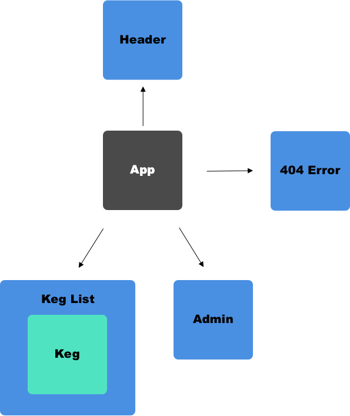

# Taproom React

#### Epicodus project, 11.9.18

#### By Brendan Shea

## Description

Building an application with Angular was cool, but it's time to give another client-side router a go.

This project uses React to build a taproom that allows admins to update their keg list and allows users to view those kegs. For a look at what the project looked like in Angular, check the "Links" section below.

As I built this project, I started to get the sense that components in React tend to be much more granular than components in Angular. In Angular, I was building fairly robust applications that made multiple API calls, however, it was only necessary to create one or two components.

## Construction

* **App Component:** houses all the other components in the application and is rendered in **index.jsx**.
* **Header Component:** header with logo.
* **Keg List Component:** loops through a hard coded database of kegs.
* **Keg Component:** passes props to display the kegs that were looped through in the keg list component.
* **Admin Component:** allows admins to sell pints, change prices, etc.
* **Error 404 Component:** a 404 error page that you're routed to if a wrong URL is used.

## Install Instructions

From the desktop:

* `git clone https://github.com/bjrshea/taproom-react.git`

From the project directory:

* `npm install`
* `npm run start`

Linting:

* `npm run lint` <--- this will show errors
* `npm run lint-fix` <--- this will fix errors if possible

## Contribution Requirements

1. Clone the repo
1. Make a new branch
1. Commit and push your changes
1. Create a PR

## Technologies Used

* JavaScript
* React
* NPM
* Babel
* ES Lint

## Notes & Challenges

1. The first thing I found challenging with this project was setting up my linter. There were some specific installs I needed that I ended up searching for online. In the end, I created a dev environment shell that works great.
2. I had an issue figuring out where I should place/style certain divs. This became a bit of an issue with my Keg List & Keg components, but I was able to break down where I needed certain styles.

## Links

* [Taproom Angular](https://github.com/bjrshea/taproom-angular.git)
